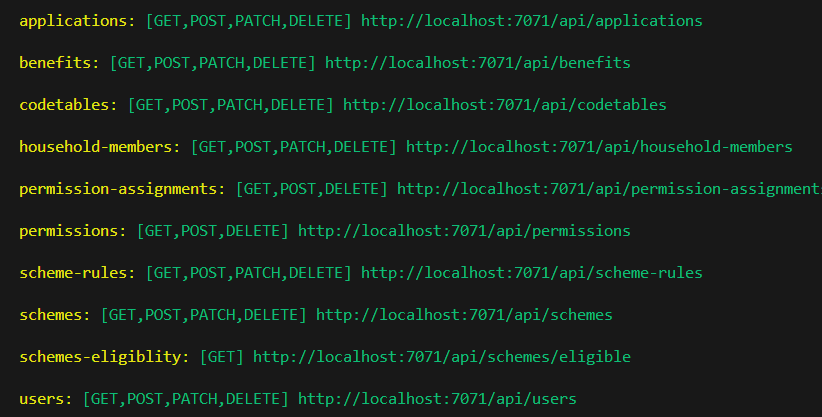
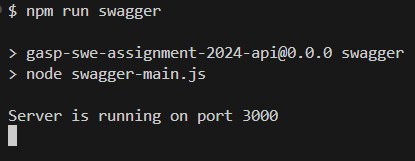
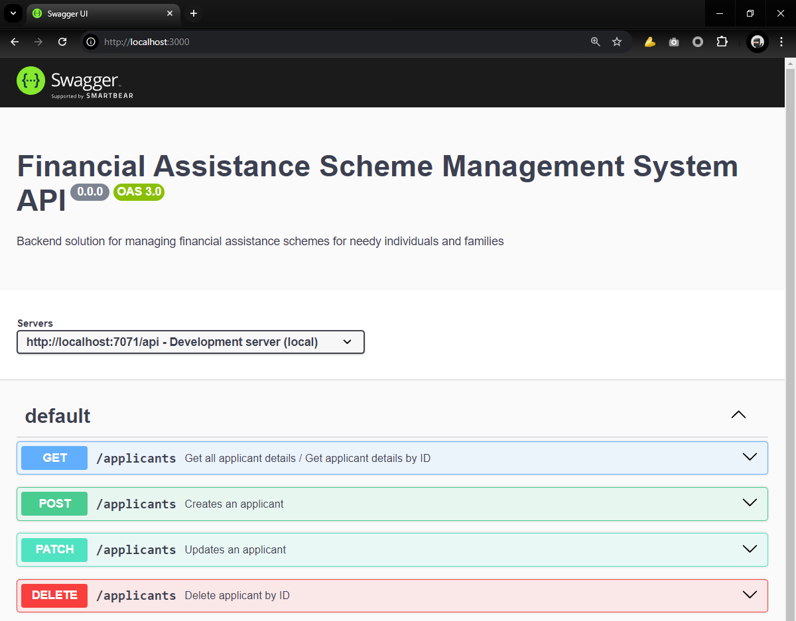
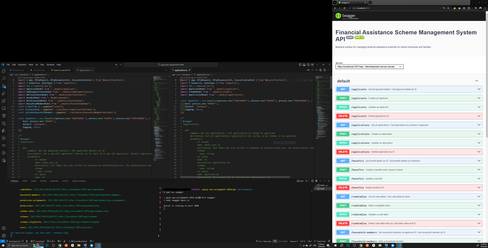
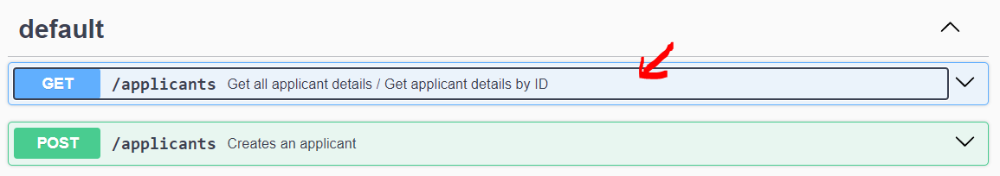
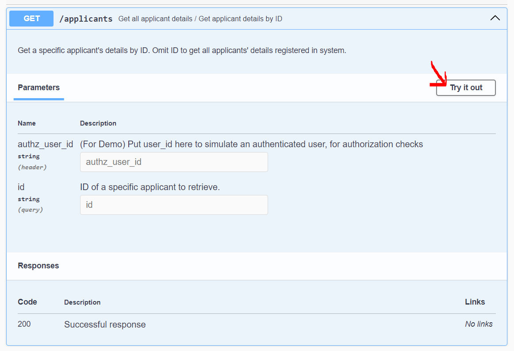
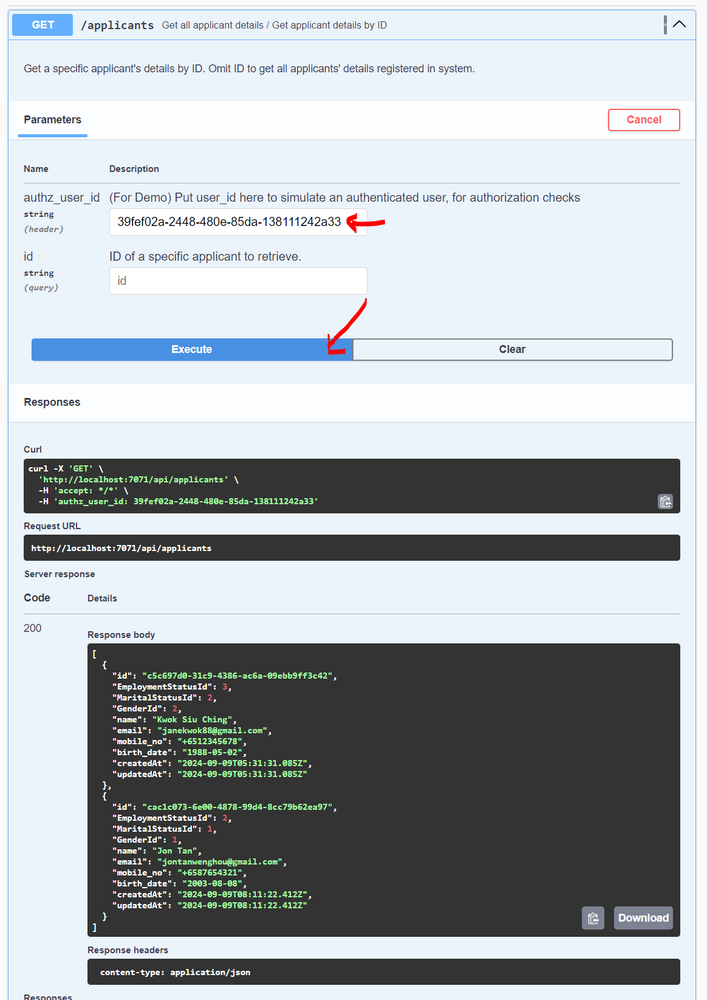

# How to Use

## Requirements

### IDE


- Any IDE that works with TypeScript is sufficient. I prefer mine with terminal windows to work off 1 screen, so I've been using **Visual Studio Code**.

- [```git```](https://git-scm.com/downloads) is recommended for cloning this repo and following the guide
- [```Swagger UI```](https://swagger.io/tools/swagger-ui/download/) is handy to test the APIs with, though a local Swagger UI webserver has aready been included to automatically generate the OAI specs, and the UI to test the APIs with.

### Application

- [```Node.js```](https://nodejs.org/en/download/package-manager) needs to be installed

### DB + Viewer

- [```Docker Desktop```](https://www.docker.com/products/docker-desktop/) is recommended in order to use the included PostgreSQL Dockerfile, installing / using your own PostgreSQL server is fine.
- [```pgAdmin```](https://www.pgadmin.org/download/) is nice to have as a DB viewer to view how the data works

## Using the APIs
The REST APIs generally follow the data model, with a few exceptions.

### Business Application
- ```/schemes``` - Financial assistance schemes
    - ```/benefits``` - Benefits available under the schemes
    - ```/scheme/eligible``` - Endpoint for determining schemes that an applicant is eligible for
    - ```/scheme-rules``` - The stored JSON for ```json-web-engine``` that represent Rules Engine configuration  

- ```/applicants``` - People who apply for schemes to receive benefits  
    - ```/household-members``` - Household members registered under each applicant

- ```/applications``` - The representation of an applicant's **application** to the financial assistance scheme 

### User + Authorization Management
- ```/users``` - The users that interact with the system
- ```/permissions``` - The ability for user
    - ```/permission-assignments``` - Representation of a permission assigned to a user

### Auxillary
- ```/codetables``` - "Lookup" tables that store a numerical value that represents a certain text value, like enums. More helpful for UI applications or working with different languages.

## Using the Rules Engine Testbed

A testbed for ```json-web-engine``` is available in the ```rules-engine-sample``` directory. You can explore the source examples with ```npm run example``` and ```npm run microsoft-example```, as well as one implementation of a Schemes Rule with ```npm start```.

You can use this testbed to further develop and explore json rulesets for use in this application.

## Configuration Settings

The environment variables for this project are stored under Azure Functions' ```local.settings.json``` file. A ```local.settings.json.sample``` file is included in this project which you can rename to ```local.settings.json``` to allow the application to run.

## Authorization

In its default settings, authorization has been disabled. You can enable it by going to ```local.settings.json```, and editing the last line from ```"ENABLE_AUTHORIZATION": "false"``` to ```"ENABLE_AUTHORIZATION": "true"``` 

Remember to restart the Node.js application after saving the ```local.settings.json``` file for changes to take effect.

# Guided Tour

This tour will walk you through on how to interact with the different parts of this system ASAP.

- Setting Up
- Using Swagger
- Guided User Story

This guide also assumes you have the following in your machine:
- Git
- Visual Studio Code
- Node with npm
- [Docker Desktop](https://www.docker.com/products/docker-desktop/)
- Localhost Ports 7071, 5432, 3000 are free

Please google if you don't know or understand - I don't have a lot of time writing all the docs and linking all the guides in this week-long assignment. :c

### Setting Up

1. Open VSCode and clone this repository
2. Press ```F1``` and type/select ```Terminal: Select Default Profile``` 
3. Select ```Git Bash```
    - (If you don't see it, you have not installed Git yet)
4. Open the terminal with ``` Ctrl + ` ``` (tilde key)
5. Navigate to ```database``` directory with: 
``` 
cd database/
```
6. Build the postgresql image with this command.
    - If you have problems, check if Docker Desktop is on.
```
docker build -t local-postgres-db ./
```
7. Run the image
```
docker run -d --name local-postgresdb-container -p 5432:5432 local-postgres-db
````
8. Now navigate to the ```api``` directory with
```
cd ../api/
```
9. Install the NPM dependencies with
```
npm i
```
10. Run the main application with
```
npm start
```
11. Wait till you see a list of functions like so:



12. Press ```Ctrl + Shift + 5``` to split the screen

13. Click on the newly opened terminal, and start the Swagger UI app with
```
npm run swagger
```
14. Wait till you see the following on the console:



15. Open your web browser, and navigate to ```http://localhost:3000/```



16. Here's a picture of what my screen typically looks like, building on this system: (I use a 2nd screen, and the swagger docs might look different)



### Using Swagger

1. Click on the API that you want to test



2. Click on the 'Try is out' button



3. Enter the necessary values and click on the 'Execute' button, view the response



### Guided User Story

