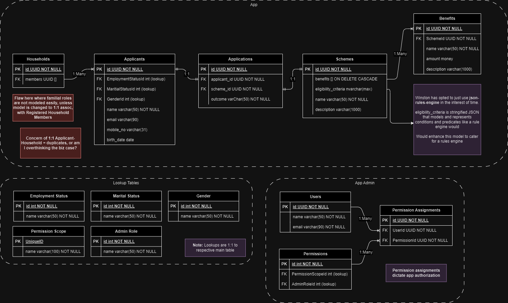
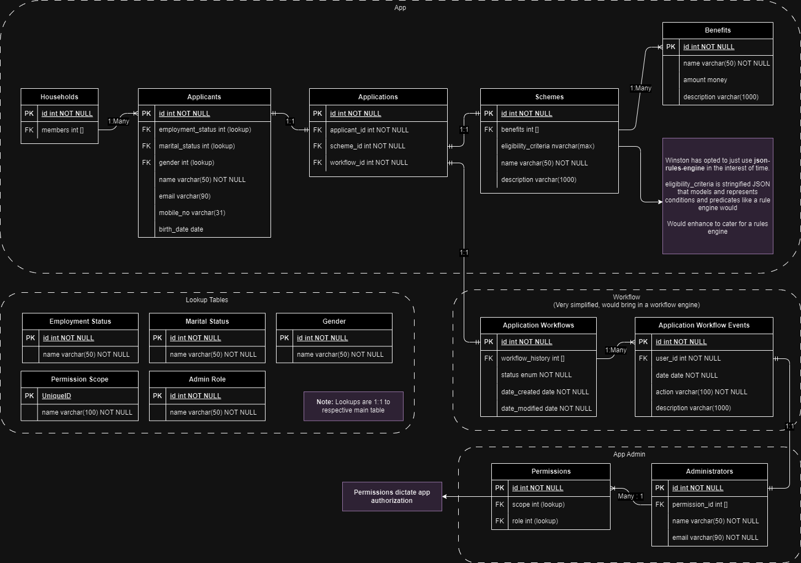

# Overview

This document is mostly theory and prose. If you are interested in making things work - I recommend checking out the [How To Use](./how-to-use.md) doc.

## Tech Stack

### Application

The application is developed in **TypeScript** and runs on **Node.js** - this project is an exploration of, and an attempt at translating enterprise-scale applications into a lighter and serverless implementation which can be easily scalable with cloud services.

I think the fun part is being able to piece up a (relatively) complete solution within a short time, using a language that originated from JavaScript, which was mostly seen as a 'frontend' only thing back then.

NodeJS still has its limitations that keep it from doing well in certain use cases, like computationally heavy stuff, but for most CRUD applications, I think NodeJS can be considered, provided the application is sufficiently well-designed, and other platfoms brought into the fold to help in places where NodeJS falls behind in.

### Rules Engine

This application, being a NodeJs implementation, and with me being tight for time, uses [```json-rules-engine```](https://www.npmjs.com/package/json-rules-engine), because JSON is easily stringified and stored in the DB as string values. Nominally you would want to bring in a more complete system that handles both rules and workflows. Since that is out of scope, I felt using ```json-rules-engine``` is sufficient for the problem statement(s) described. Simpler is nicer.

**The rest of the section explains the use of a Rules Engine. Feel free to skip.**

The problem statement describes being able to retrieve a list of schemes that users are eligible for - for the uninitated, that calls for a "Rules Engine" to be folded into the system.

Because the system needed to be able to determine eligibility based on sets of rules, it would be tempting to develop individual services and classes specifically tailored for a particular scheme. However, imagine working with a business that has hundreds of schemes that change frequently - frequent maintenance of application code would be tedious.

Instead, why not move the maintenance and management of rules to the business user? Thats where you have entire products for this use case. With a graphical UI, its easier for non-technical users to 'program' rules and workflows that automate otherwise tedious business rules, regulations and constraints which are difficult to navigate manually.

### Database

This application uses **PostgreSQL** because I haven't worked with it before, while [```sequelize```](https://sequelize.org/) serves as the ORM to simplify working with a relational database. 

Since the premise is financial support, I think it makes sense to go for a relational database, since you will need the data integrity and ACID compliance that are important for financial systems. Moving on from there, you can move towards bringing in Online Transaction Processing (OLTP) and Online Analytical Processing (OLAP) systems.

## Data Design

This is the database model I have iterated on several times while designing my APIs. Please pardon the inaccuracies, because I had limited time to check if my modelling was correct. Further below are a few initial iterations and considerations I've thought about initially, and while testing the APIs early on.

(Remember to replace when done diagramming)

### Current Iteration



### v2


### v1


